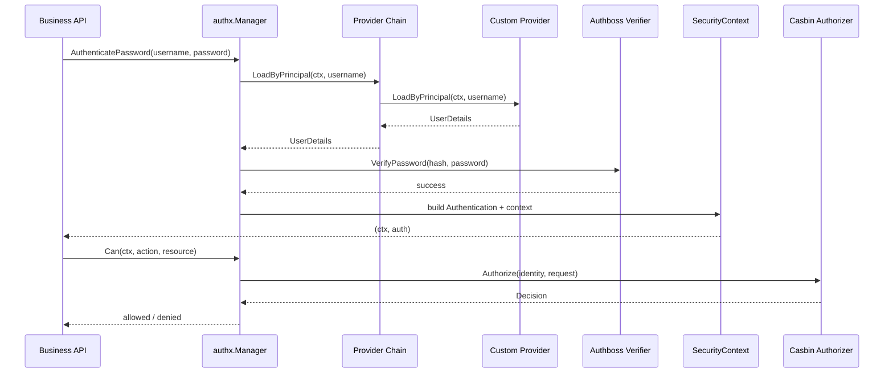

## authx

`authx` is an opinionated Go security library.

It is based on:

- **Authboss** for authentication
- **Casbin** for authorization

## Roadmap

- Module roadmap: [authx roadmap](./roadmap)
- Iteration execution plan: [authx iteration plan](./iteration-plan)
- Global roadmap: [ArcGo roadmap](../roadmap)

## Design Goals

Business code should only interact with the AuthX API:

- Build a `Manager`
- Authenticate users and get an `Authentication` object + new `context.Context`
- Use `manager.Can(...)` to check permissions
- Manually call `LoadPolicies` / `ReplacePolicies` when policies change

Authboss and Casbin remain internal implementation details.

## Core API

- `IdentityProvider`: Load user data (`UserDetails`) by principal
- `InMemoryIdentityProvider`: Runtime-mutable built-in provider
- `PolicySource`: Load complete policy snapshot (`PolicySnapshot`)
- `InMemoryPolicySource`: Runtime-mutable built-in source
- `WithProvider(...)` / `WithSource(...)`: Manager building based on options
- `MappedProvider[T]` interface + `WithMappedProvider[T](provider)` generic typed provider adapter
- `Manager.Authenticate(...)` / `Manager.AuthenticatePassword(...)`
- `Manager.Can(ctx, action, resource)`
- `Manager.LoadPolicies()` / `Manager.LoadPoliciesFrom(...)`
- `Manager.ReplacePolicies(...)` for manual hot reload
- `Manager.SetIdentityProviders(...)` / `Manager.AddIdentityProvider(...)` for provider chain management
- `Manager.SetPolicySources(...)` / `Manager.AddPolicySource(...)` for source chain management
- `SecurityContext` / `Authentication` helper functions in context

## Quick Start

```go
providerA := authx.NewInMemoryIdentityProvider()
providerB := authx.NewInMemoryIdentityProvider()
source := authx.NewInMemoryPolicySource(authx.NewPolicySnapshot(perms, roles))

manager, err := authx.NewManager(
    authx.WithSource(source),
    authx.WithProvider(providerA),
    authx.WithProvider(providerB),
)
if err != nil {
    panic(err)
}

_, err = manager.LoadPolicies(context.Background()) // Manual load/refresh
if err != nil {
    panic(err)
}

ctx, auth, err := manager.AuthenticatePassword(context.Background(), "alice", "secret")
if err != nil {
    panic(err)
}

allowed, err := manager.Can(ctx, "read", "order:1001")
if err != nil {
    panic(err)
}

fmt.Println(auth.Identity().ID(), allowed)
```

Providers and policy sources are runtime objects, not compile-time fixed values.
You can maintain multiple authentication providers at runtime and dynamically update users/policies.

## Generic Principal Loading

`UserDetails` supports `Payload any`.
For mapped providers, the payload is automatically attached, and you can read it using generic helpers:

```go
type SQLiteMappedProvider struct {
    db *sql.DB
}

func (p SQLiteMappedProvider) LoadByPrincipal(ctx context.Context, principal string) (SQLiteUser, error) { ... }
func (p SQLiteMappedProvider) MapToUserDetails(ctx context.Context, principal string, u SQLiteUser) (authx.UserDetails, error) { ... }

manager, err := authx.NewManager(
    authx.WithMappedProvider(SQLiteMappedProvider{db: db}),
)

ctx, _, err := manager.AuthenticatePassword(context.Background(), "alice", "secret")
if err != nil { panic(err) }

principal, ok := authx.CurrentPrincipalAs[MyUser](ctx)
if !ok { panic("principal type mismatch") }
```

## Logging (slog)

`authx` accepts the standard library `*slog.Logger` and logs key nodes:

- Manager lifecycle and policy reload
- Provider chain lookup
- Authentication verification results
- Authorization decisions

```go
appLogger, err := logx.New(logx.WithConsole(true), logx.WithLevel(logx.DebugLevel))
if err != nil { panic(err) }
defer appLogger.Close()

manager, err := authx.NewManager(
    authx.WithLogger(logx.NewSlog(appLogger)),
    authx.WithSource(source),
    authx.WithProvider(provider),
)
```

## Optional Observability

`authx` can emit optional metrics/traces via `WithObservability(...)`.

```go
otelObs := otelobs.New()
promObs := promobs.New()
obs := observabilityx.Multi(otelObs, promObs)

manager, err := authx.NewManager(
    authx.WithObservability(obs),
    authx.WithSource(source),
    authx.WithProvider(provider),
)
```

## Authentication Flow



## Custom Provider Example

```mermaid
flowchart LR
    R[UserRepository<br/>DB/Redis/HTTP] --> P[Custom IdentityProvider]
    P --> M[authx.NewManager<br/>WithProvider(provider)]
    M --> A[AuthenticatePassword]
    A --> C[SecurityContext + Authentication]
    C --> Z[Can(action, resource)]
```

```go
type UserRepository interface {
    FindByPrincipal(ctx context.Context, principal string) (userRecord, error)
}

type RepositoryIdentityProvider struct {
    repo UserRepository
}

func (p *RepositoryIdentityProvider) LoadByPrincipal(ctx context.Context, principal string) (authx.UserDetails, error) {
    record, err := p.repo.FindByPrincipal(ctx, principal)
    if err != nil {
        return authx.UserDetails{}, err
    }
    return authx.UserDetails{
        ID:           record.ID,
        Principal:    record.Principal,
        PasswordHash: record.PasswordHash,
        Name:         record.Name,
    }, nil
}

manager, err := authx.NewManager(
    authx.WithProvider(&RepositoryIdentityProvider{repo: repo}),
    authx.WithSource(policySource),
)
```

## Manual Policy Hot Reload

You can hot reload policies at runtime without exposing Casbin details:

```go
// Reload from configuration source
version, err := manager.LoadPolicies(ctx)

// Reload from new source and switch default source
version, err = manager.LoadPoliciesFrom(ctx, anotherSource)

// Replace directly with memory snapshot
version, err = manager.ReplacePolicies(ctx, authx.NewPolicySnapshot(perms, roles))

// Replace provider chain at runtime
err = manager.SetIdentityProviders(providerA, providerB, providerC)

// Append a provider to the chain
err = manager.AddIdentityProvider(providerD)

// Replace source chain at runtime
err = manager.SetPolicySources(sourceA, sourceB)

// Append a source to the chain
err = manager.AddPolicySource(sourceC)
```

The `version` increments on each successful reload.

## Runtime Components

- [manager.go](https://github.com/DaiYuANg/arcgo/tree/main/authx/manager.go): High-level API facade
- [security_context.go](https://github.com/DaiYuANg/arcgo/tree/main/authx/security_context.go): Security context + authentication object
- [authboss_authenticator.go](https://github.com/DaiYuANg/arcgo/tree/main/authx/authboss_authenticator.go): Internal authboss authenticator
- [casbin_authorizer.go](https://github.com/DaiYuANg/arcgo/tree/main/authx/casbin_authorizer.go): Internal casbin authorizer

## Examples

- [authboss_password](https://github.com/DaiYuANg/arcgo/tree/main/authx/examples/authboss_password): Login only
- [casbin_authorizer](https://github.com/DaiYuANg/arcgo/tree/main/authx/examples/casbin_authorizer): Manual policy hot reload
- [quickstart](https://github.com/DaiYuANg/arcgo/tree/main/authx/examples/quickstart): End-to-end flow with providers + policy sources
- [custom_provider](https://github.com/DaiYuANg/arcgo/tree/main/authx/examples/custom_provider): Implement `IdentityProvider` with repository abstraction
- [sqlite_auth](https://github.com/DaiYuANg/arcgo/tree/main/authx/examples/sqlite_auth): Load users from SQLite and authenticate
- [redis_auth](https://github.com/DaiYuANg/arcgo/tree/main/authx/examples/redis_auth): Load users from Redis and authenticate
- [observability](https://github.com/DaiYuANg/arcgo/tree/main/authx/examples/observability): Integrate `authx` with optional OTel + Prometheus observability

## Testing

```bash
go test ./authx/...

# Run benchmarks
go test ./authx -run ^$ -bench BenchmarkManager -benchmem
```
