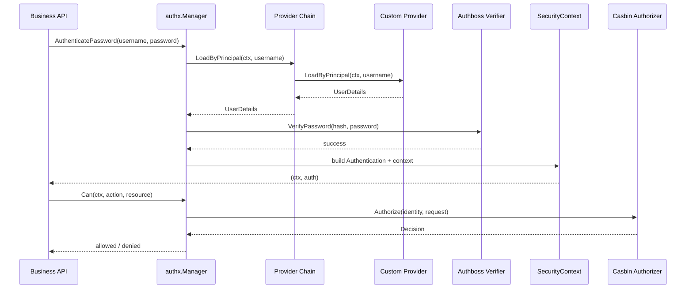

## authx

`authx` 是一个 Opinionated 的 Go 安全库。

它基于：

- **Authboss** 用于认证
- **Casbin** 用于授权

## 设计目标

业务代码应该只与 AuthX API 交互：

- 构建一个 `Manager`
- 认证用户并获取 `Authentication` 对象 + 新的 `context.Context`
- 使用 `manager.Can(...)` 检查权限
- 策略变更时手动调用 `LoadPolicies` / `ReplacePolicies`

Authboss 和 Casbin 保持为内部实现细节。

## 核心 API

- `IdentityProvider`: 通过 principal 加载用户数据 (`UserDetails`)
- `InMemoryIdentityProvider`: 运行时可变内置提供者
- `PolicySource`: 加载完整策略快照 (`PolicySnapshot`)
- `InMemoryPolicySource`: 运行时可变内置源
- `WithProvider(...)` / `WithSource(...)`: 基于选项的管理器构建
- `MappedProvider[T]` 接口 + `WithMappedProvider[T](provider)` 泛型类型化提供者适配器
- `Manager.Authenticate(...)` / `Manager.AuthenticatePassword(...)`
- `Manager.Can(ctx, action, resource)`
- `Manager.LoadPolicies()` / `Manager.LoadPoliciesFrom(...)`
- `Manager.ReplacePolicies(...)` 用于手动热重载
- `Manager.SetIdentityProviders(...)` / `Manager.AddIdentityProvider(...)` 用于提供者链管理
- `Manager.SetPolicySources(...)` / `Manager.AddPolicySource(...)` 用于源链管理
- `SecurityContext` / `Authentication` context 中的辅助函数

## 快速开始

```go
providerA := authx.NewInMemoryIdentityProvider()
providerB := authx.NewInMemoryIdentityProvider()
source := authx.NewInMemoryPolicySource(authx.NewPolicySnapshot(perms, roles))

manager, err := authx.NewManager(
    authx.WithSource(source),
    authx.WithProvider(providerA),
    authx.WithProvider(providerB),
)
if err != nil {
    panic(err)
}

_, err = manager.LoadPolicies(context.Background()) // 手动加载/刷新
if err != nil {
    panic(err)
}

ctx, auth, err := manager.AuthenticatePassword(context.Background(), "alice", "secret")
if err != nil {
    panic(err)
}

allowed, err := manager.Can(ctx, "read", "order:1001")
if err != nil {
    panic(err)
}

fmt.Println(auth.Identity().ID(), allowed)
```

提供者和策略源是运行时对象，而非编译时固定值。
你可以在运行时维护多个认证提供者并动态更新用户/策略。

## 泛型 Principal 负载

`UserDetails` 支持 `Payload any`。
对于映射的提供者，负载会自动附加，你可以使用泛型辅助函数读取：

```go
type SQLiteMappedProvider struct {
    db *sql.DB
}

func (p SQLiteMappedProvider) LoadByPrincipal(ctx context.Context, principal string) (SQLiteUser, error) { ... }
func (p SQLiteMappedProvider) MapToUserDetails(ctx context.Context, principal string, u SQLiteUser) (authx.UserDetails, error) { ... }

manager, err := authx.NewManager(
    authx.WithMappedProvider(SQLiteMappedProvider{db: db}),
)

ctx, _, err := manager.AuthenticatePassword(context.Background(), "alice", "secret")
if err != nil { panic(err) }

principal, ok := authx.CurrentPrincipalAs[MyUser](ctx)
if !ok { panic("principal type mismatch") }
```

## 日志 (slog)

`authx` 接受标准库 `*slog.Logger` 并记录关键节点：

- 管理器生命周期和策略重载
- 提供者链查找
- 认证验证结果
- 授权决策

```go
appLogger, err := logx.New(logx.WithConsole(true), logx.WithLevel(logx.DebugLevel))
if err != nil { panic(err) }
defer appLogger.Close()

manager, err := authx.NewManager(
    authx.WithLogger(logx.NewSlog(appLogger)),
    authx.WithSource(source),
    authx.WithProvider(provider),
)
```

## 可选可观测性

`authx` 可以通过 `WithObservability(...)` 发出可选的指标/追踪。

```go
otelObs := otelobs.New()
promObs := promobs.New()
obs := observability.Multi(otelObs, promObs)

manager, err := authx.NewManager(
    authx.WithObservability(obs),
    authx.WithSource(source),
    authx.WithProvider(provider),
)
```

## 认证流程



## 自定义提供者示例

```mermaid
flowchart LR
    R[UserRepository<br/>DB/Redis/HTTP] --> P[Custom IdentityProvider]
    P --> M[authx.NewManager<br/>WithProvider(provider)]
    M --> A[AuthenticatePassword]
    A --> C[SecurityContext + Authentication]
    C --> Z[Can(action, resource)]
```

```go
type UserRepository interface {
    FindByPrincipal(ctx context.Context, principal string) (userRecord, error)
}

type RepositoryIdentityProvider struct {
    repo UserRepository
}

func (p *RepositoryIdentityProvider) LoadByPrincipal(ctx context.Context, principal string) (authx.UserDetails, error) {
    record, err := p.repo.FindByPrincipal(ctx, principal)
    if err != nil {
        return authx.UserDetails{}, err
    }
    return authx.UserDetails{
        ID:           record.ID,
        Principal:    record.Principal,
        PasswordHash: record.PasswordHash,
        Name:         record.Name,
    }, nil
}

manager, err := authx.NewManager(
    authx.WithProvider(&RepositoryIdentityProvider{repo: repo}),
    authx.WithSource(policySource),
)
```

## 手动策略热重载

你可以在运行时热重载策略，而无需暴露 Casbin 细节：

```go
// 从配置源重载
version, err := manager.LoadPolicies(ctx)

// 从新源重载并切换默认源
version, err = manager.LoadPoliciesFrom(ctx, anotherSource)

// 直接使用内存快照替换
version, err = manager.ReplacePolicies(ctx, authx.NewPolicySnapshot(perms, roles))

// 运行时替换提供者链
err = manager.SetIdentityProviders(providerA, providerB, providerC)

// 追加一个提供者到链
err = manager.AddIdentityProvider(providerD)

// 运行时替换源链
err = manager.SetPolicySources(sourceA, sourceB)

// 追加一个源到链
err = manager.AddPolicySource(sourceC)
```

每次成功重载时 `version` 会递增。

## 运行时组件

- [manager.go](https://github.com/DaiYuANg/arcgo/tree/main/authx/manager.go): 高级 API 门面
- [security_context.go](https://github.com/DaiYuANg/arcgo/tree/main/authx/security_context.go): 安全上下文 + 认证对象
- [authboss_authenticator.go](https://github.com/DaiYuANg/arcgo/tree/main/authx/authboss_authenticator.go): 内部 authboss 认证器
- [casbin_authorizer.go](https://github.com/DaiYuANg/arcgo/tree/main/authx/casbin_authorizer.go): 内部 casbin 授权器

## 示例

- [authboss_password](https://github.com/DaiYuANg/arcgo/tree/main/authx/examples/authboss_password): 仅登录
- [casbin_authorizer](https://github.com/DaiYuANg/arcgo/tree/main/authx/examples/casbin_authorizer): 手动策略热重载
- [quickstart](https://github.com/DaiYuANg/arcgo/tree/main/authx/examples/quickstart): 带有提供者 + 策略源的端到端流程
- [custom_provider](https://github.com/DaiYuANg/arcgo/tree/main/authx/examples/custom_provider): 使用仓库抽象实现 `IdentityProvider`
- [sqlite_auth](https://github.com/DaiYuANg/arcgo/tree/main/authx/examples/sqlite_auth): 从 SQLite 加载用户并认证
- [redis_auth](https://github.com/DaiYuANg/arcgo/tree/main/authx/examples/redis_auth): 从 Redis 加载用户并认证
- [observability](https://github.com/DaiYuANg/arcgo/tree/main/authx/examples/observability): 将 `authx` 与可选的 OTel + Prometheus 可观测性集成

## 测试

```bash
go test ./authx/...

# 运行基准测试
go test ./authx -run ^$ -bench BenchmarkManager -benchmem
```
